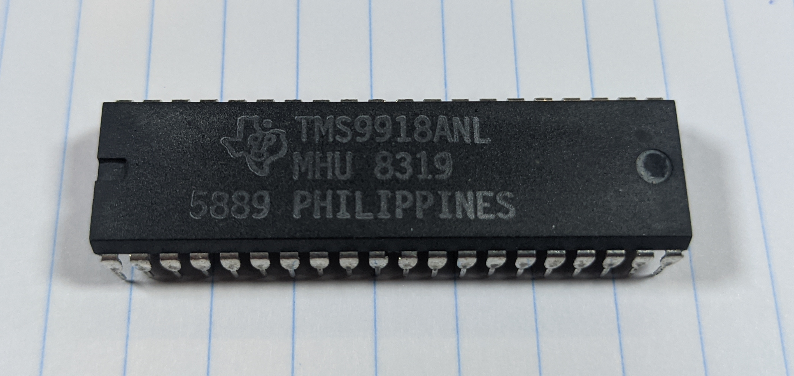
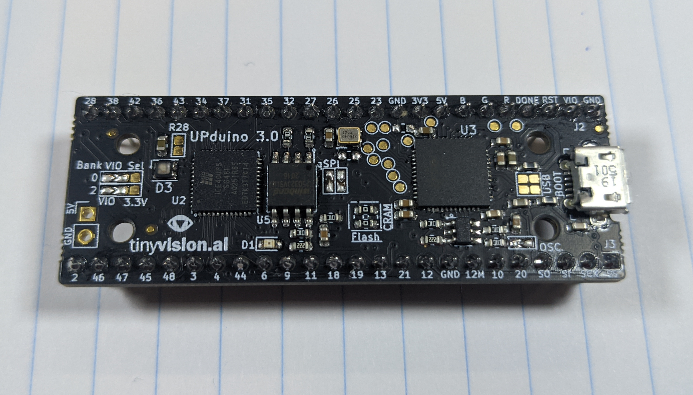
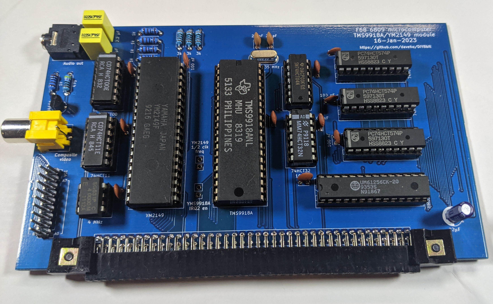
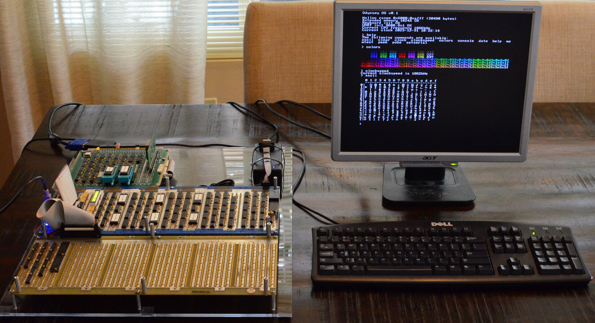
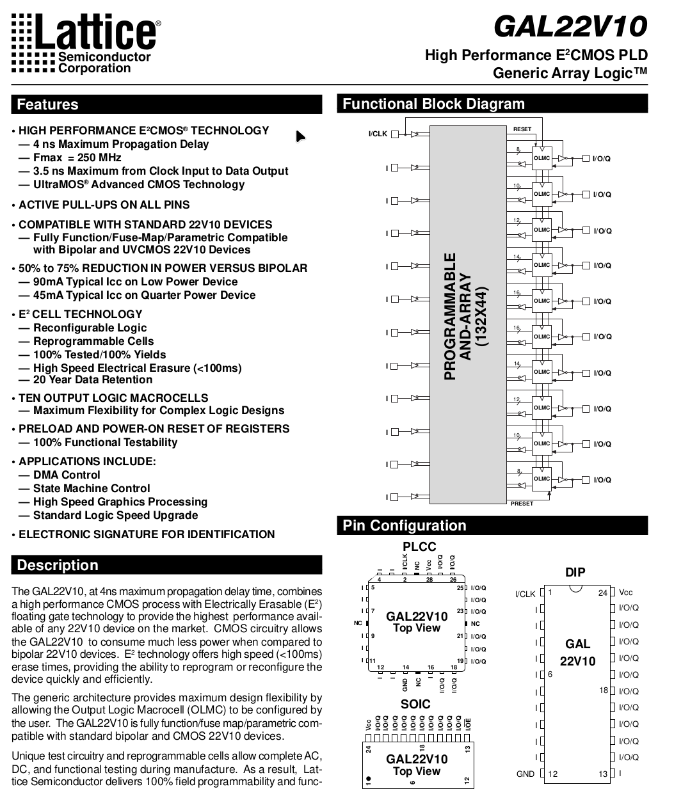
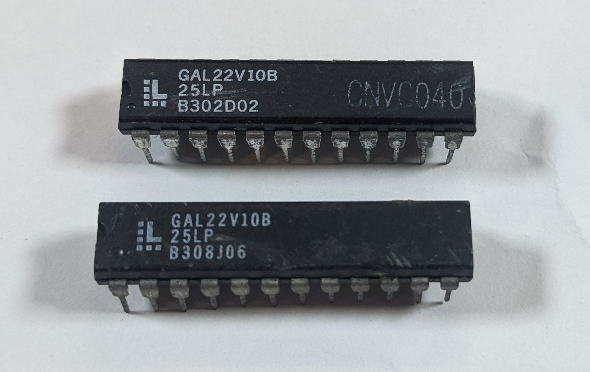
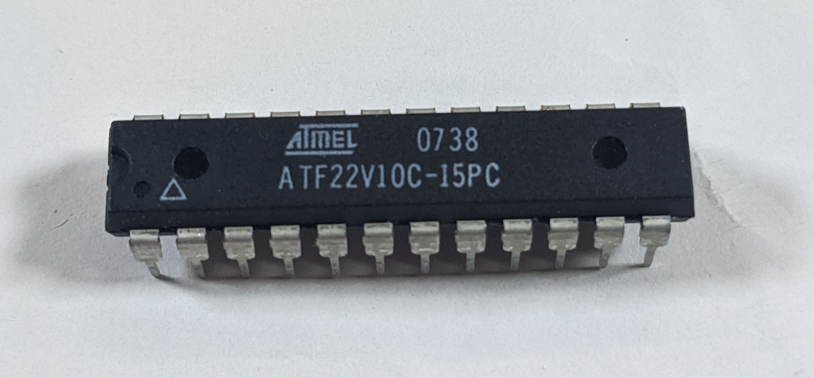

## 

::: { .absolute x=0.5in y=0.85in width=3in }

{ width=3in }

:::

## Hello! { .t }

New (but kind of not new) project!

## Hello! { .t }

New (but kind of not new) project!

Why no real videos for quite a while?

## Hello! { .t }

New (but kind of not new) project!

Why no real videos for quite a while?

* 8-bit computer project: initially lots of progress, lots of fun

## Hello! { .t }

New (but kind of not new) project!

Why no real videos for quite a while?

* 8-bit computer project: initially lots of progress, lots of fun
* Display controller: huge road block. Initial options:

## Hello! { .t }

New (but kind of not new) project!

Why no real videos for quite a while?

* 8-bit computer project: initially lots of progress, lots of fun
* Display controller: huge road block. Initial options:
  1. "Retro" display controller (e.g., TMS9918A)

::: { .absolute x=3in y=1.75in width=2.5in }



:::

## Hello! { .t }

New (but kind of not new) project!

Why no real videos for quite a while?

* 8-bit computer project: initially lots of progress, lots of fun
* Display controller: huge road block. Initial options:
  1. "Retro" display controller (e.g., TMS9918A)
  2. FPGA with custom design

::: { .absolute x=3in y=1.75in width=2.5in }



:::

## Hello! { .t }

New (but kind of not new) project!

Why no real videos for quite a while?

* 8-bit computer project: initially lots of progress, lots of fun
* Display controller: huge road block. Initial options:
  1. "Retro" display controller (e.g., TMS9918A)
  2. FPGA with custom design

Initially I thought option \#2 was best

## FPGAs are hard { .t }

Difficulties:

## FPGAs are hard { .t }

Difficulties:

* Hard to know what is going on inside the FPGA

## FPGAs are hard { .t }

Difficulties:

* Hard to know what is going on inside the FPGA
* Can't probe signals

## FPGAs are hard { .t }

Difficulties:

* Hard to know what is going on inside the FPGA
* Can't probe signals
* Need to use simulation and possibly formal verification

## FPGAs are hard { .t }

Difficulties:

* Hard to know what is going on inside the FPGA
* Can't probe signals
* Need to use simulation and possibly formal verification

My problem: I wasn't having fun!

## FPGAs are hard { .t }

Difficulties:

* Hard to know what is going on inside the FPGA
* Can't probe signals
* Need to use simulation and possibly formal verification

My problem: I wasn't having fun!

* I like building things

## FPGAs are hard { .t }

Difficulties:

* Hard to know what is going on inside the FPGA
* Can't probe signals
* Need to use simulation and possibly formal verification

My problem: I wasn't having fun!

* I like building things
* I like debugging circuits (using multimeter, oscilloscope, etc.)

## What about option \#1? { .t }

I did experiment with the TMS9918A with some success:

{ .center width=3.5in }

I will return to this at some point

## What to do? { .t }

Was feeling very unmotivated: option \#1 unsatisfactory, option \#2 not fun

## What to do? { .t }

Was feeling very unmotivated: option \#1 unsatisfactory, option \#2 not fun

**What if there was a third option?**

## What to do? { .t }

Was feeling very unmotivated: option \#1 unsatisfactory, option \#2 not fun

**What if there was a third option?**

Wire Wrap Odyssey project (<https://wirewrapodyssey.com>)

VGA text display implemented using logic chips!

::: { .absolute x=2.75in y=1.625in width=3in }

{ width=3in }

:::

## What to do? { .t }

Was feeling very unmotivated: option \#1 unsatisfactory, option \#2 not fun

**What if there was a third option?**

Wire Wrap Odyssey project (<https://wirewrapodyssey.com>)

VGA text display implemented using logic chips!

::: { .absolute x=2.75in y=1.625in width=3in }

{ width=3in }

:::

``` {=latex}
\vskip .1in
\hspace{.2in}\fbox{\parbox{1.5in}{
\Large Could I do\\
something similar?
}}
```

## Why VGA text mode using logic chips? { .t }

## Why VGA text mode using logic chips? { .t }

1. Fun!

## Why VGA text mode using logic chips? { .t }

1. Fun!
2. Use actual hardware!

## Why VGA text mode using logic chips? { .t }

1. Fun!
2. Use actual hardware!
3. Direct access to signals

## Why VGA text mode using logic chips? { .t }

1. Fun!
2. Use actual hardware!
3. Direct access to signals
4. Modular design $\rightarrow$ build and test incrementally

## Why VGA text mode using logic chips? { .t }

1. Fun!
2. Use actual hardware!
3. Direct access to signals
4. Modular design $\rightarrow$ build and test incrementally

There are challenges...

## Why VGA text mode using logic chips? { .t }

1. Fun!
2. Use actual hardware!
3. Direct access to signals
4. Modular design $\rightarrow$ build and test incrementally

There are challenges...

`\hspace{.25in}`{=latex} ...but I think they can be managed

## Challenge \#1: Hardware Complexity { .t }

## Challenge \#1: Hardware Complexity { .t }

Problem: design could require a large number of logic chips

## Challenge \#1: Hardware Complexity { .t }

Problem: design could require a large number of logic chips

Solution: use programmable logic!

## Challenge \#1: Hardware Complexity { .t }

Problem: design could require a large number of logic chips

Solution: use programmable logic!

Wait, didn't you say that programmable logic wasn't fun?

## Challenge \#1: Hardware Complexity { .t }

Problem: design could require a large number of logic chips

Solution: use programmable logic!

Wait, didn't you say that programmable logic wasn't fun?

GAL devices! (e.g., GAL22V10)

::: { .absolute x=4.25in y=1in width=2in }

{ width=2in }

:::

::: { .absolute x=4in y=1.5in width=2in }

{ width=2in }

:::

## Challenge \#1: Hardware Complexity { .t }

Problem: design could require a large number of logic chips

Solution: use programmable logic!

Wait, didn't you say that programmable logic wasn't fun?

GAL devices! (e.g., GAL22V10)

* Can replace multiple discrete chips

::: { .absolute x=4.25in y=1in width=2in }

{ width=2in }

:::

::: { .absolute x=4in y=1.5in width=2in }

{ width=2in }

:::

## Challenge \#1: Hardware Complexity { .t }

Problem: design could require a large number of logic chips

Solution: use programmable logic!

Wait, didn't you say that programmable logic wasn't fun?

GAL devices! (e.g., GAL22V10)

* Can replace multiple discrete chips
* Easy to source (EBay, etc.)

::: { .absolute x=4.25in y=1in width=2in }

{ width=2in }

:::

::: { .absolute x=4in y=1.5in width=2in }

{ width=2in }

:::

## Challenge \#1: Hardware Complexity { .t }

Problem: design could require a large number of logic chips

Solution: use programmable logic!

Wait, didn't you say that programmable logic wasn't fun?

GAL devices! (e.g., GAL22V10)

* Can replace multiple discrete chips
* Easy to source (EBay, etc.)
* Atmel has compatible parts still in  
  production!

::: { .absolute x=4.25in y=1in width=2in }

{ width=2in }

:::

::: { .absolute x=3.75in y=1.5in width=2.5in }

{ width=2.5in }

:::

## Challenge \#1: Hardware Complexity { .t }

Problem: design could require a large number of logic chips

Solution: use programmable logic!

Wait, didn't you say that programmable logic wasn't fun?

GAL devices! (e.g., GAL22V10)

* Can replace multiple discrete chips
* Easy to source (EBay, etc.)
* Atmel has compatible parts still in  
  production!
* Easily programmed

::: { .absolute x=4.25in y=1in width=2in }

{ width=2in }

:::

::: { .absolute x=3.75in y=1.5in width=2.5in }

{ width=2.5in }

:::

## Challenge \#1: Hardware Complexity { .t }

Problem: design could require a large number of logic chips

Solution: use programmable logic!

Wait, didn't you say that programmable logic wasn't fun?

GAL devices! (e.g., GAL22V10)

* Can replace multiple discrete chips
* Easy to source (EBay, etc.)
* Atmel has compatible parts still in  
  production!
* Easily programmed
* Fast enough for 640x480 VGA

::: { .absolute x=4.25in y=1in width=2in }

{ width=2in }

:::

::: { .absolute x=3.75in y=1.5in width=2.5in }

{ width=2.5in }

:::

## Challenge \#1: Hardware Complexity { .t }

Problem: design could require a large number of logic chips

Solution: use programmable logic!

Wait, didn't you say that programmable logic wasn't fun?

GAL devices! (e.g., GAL22V10)

* Can replace multiple discrete chips
* Easy to source (EBay, etc.)
* Atmel has compatible parts still in  
  production!
* Easily programmed
* Fast enough for 640x480 VGA
* Have pins you can probe directly!

::: { .absolute x=4.25in y=1in width=2in }

{ width=2in }

:::

::: { .absolute x=3.75in y=1.5in width=2.5in }

{ width=2.5in }

:::

## Challenge \#1: Hardware Complexity { .t }

Problem: design could require a large number of logic chips

Solution: use programmable logic!

Wait, didn't you say that programmable logic wasn't fun?

GAL devices! (e.g., GAL22V10)

* Can replace multiple discrete chips
* Easy to source (EBay, etc.)
* Atmel has compatible parts still in  
  production!
* Easily programmed
* Fast enough for 640x480 VGA
* Have pins you can probe directly!
* Reprogrammable: fix bugs easily

::: { .absolute x=4.25in y=1in width=2in }

{ width=2in }

:::

::: { .absolute x=3.75in y=1.5in width=2.5in }

{ width=2.5in }

:::

## Challenge \#2: Design Complexity { .t }

## Challenge \#2: Design Complexity { .t }

Problems:

## Challenge \#2: Design Complexity { .t }

Problems:

* With $25.175$ MHz clock, need to generate a pixel every $39.7$ ns

## Challenge \#2: Design Complexity { .t }

Problems:

* With $25.175$ MHz clock, need to generate a pixel every $39.7$ ns
* Logic to fetch data from VRAM and rasterize it will be intricate

## Challenge \#2: Design Complexity { .t }

Problems:

* With $25.175$ MHz clock, need to generate a pixel every $39.7$ ns
* Logic to fetch data from VRAM and rasterize it will be intricate
* Will be important to validate design before implementing

## Challenge \#2: Design Complexity { .t }

Problems:

* With $25.175$ MHz clock, need to generate a pixel every $39.7$ ns
* Logic to fetch data from VRAM and rasterize it will be intricate
* Will be important to validate design before implementing

Solution: simulation using Logisim Evolution

## Challenge \#2: Design Complexity { .t }

Problems:

* With $25.175$ MHz clock, need to generate a pixel every $39.7$ ns
* Logic to fetch data from VRAM and rasterize it will be intricate
* Will be important to validate design before implementing

Solution: simulation using Logisim Evolution

* Simulate design before building it

## Challenge \#2: Design Complexity { .t }

Problems:

* With $25.175$ MHz clock, need to generate a pixel every $39.7$ ns
* Logic to fetch data from VRAM and rasterize it will be intricate
* Will be important to validate design before implementing

Solution: simulation using Logisim Evolution

* Simulate design before building it
* Includes 74 series devices in library (e.g., 74x163 counter)

## Challenge \#2: Design Complexity { .t }

Problems:

* With $25.175$ MHz clock, need to generate a pixel every $39.7$ ns
* Logic to fetch data from VRAM and rasterize it will be intricate
* Will be important to validate design before implementing

Solution: simulation using Logisim Evolution

* Simulate design before building it
* Includes 74 series devices in library (e.g., 74x163 counter)
* GALs can easily be modeled using combinational logic and
  D-type flip flops
