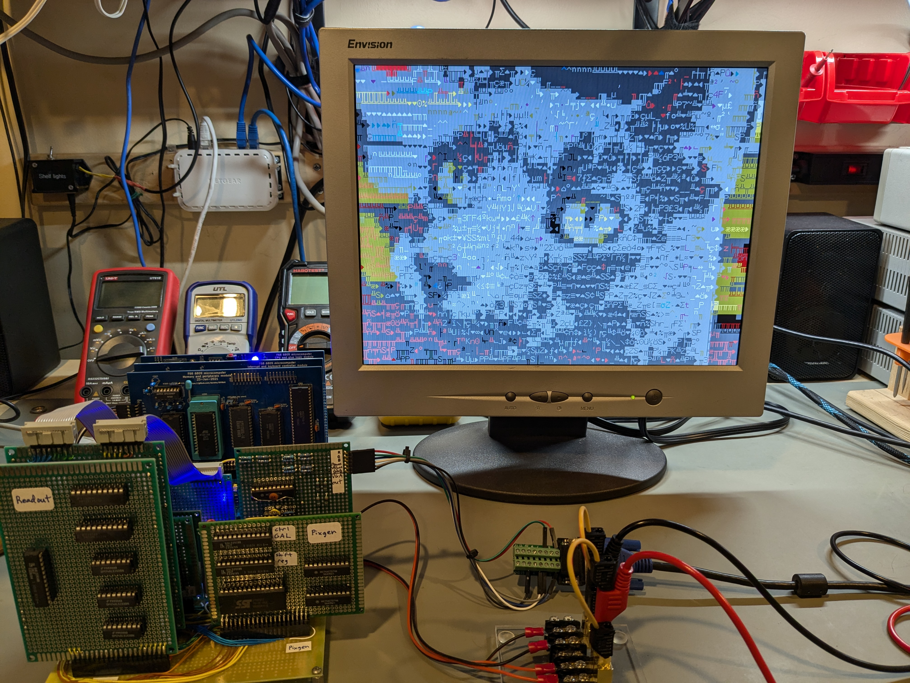

# Hardware VGA text mode project

This repository documents my (successful!) attempt to implement a VGA text mode using logic chips and GAL devices for my [8-bit computer project](https://github.com/daveho/DIY8bit).

As of the current time (late July 2024), the display controller is completely working as a hand-wired prototype.

The project is documented as a series of youtube videos:

Video | Topic(s) | Supporting materials
----- | -------- |--------------------
[Episode 01](https://youtu.be/FBDaKUfpmKo) | Sync gen and pixel output | [Episode01](Episode01)
[Episode 02](https://youtu.be/wY-jgFELOBk) | VRAM | [Episode02](Episode02)
[Episode 03](https://youtu.be/mVbhe-eQTJc) | Readout | [Episode03](Episode03)
Episode 04 | Pixel generation | [Episode04](Episode04)

There are a few photos in the [Gallery](gallery.md).

This project was inspired by the [Wire Wrap Odyssey](https://wirewrapodyssey.com) project.

I'm using [Logisim Evolution](https://github.com/logisim-evolution/logisim-evolution) to simulate parts of the design before building the hardware.

I'm using [GALasm](https://github.com/daveho/GALasm) to compile the GAL logic equations into fuse maps. Note that even though this is hosted in my Github account, I didn't write it. (I fixed a bug and then posted the code on my Github since there didn't seem to be any existing version control repo for it.)

The [HardwareDesign](HardwareDesign) directory contains the most up-to-date hardware design. The schematics were created using (of course!) [KiCad](https://www.kicad.org/). There is a [PDF of the schematic](HardwareDesign/HW_VGA.pdf) which may or may not be up to date.

This is a work in progress! I don't make any guarantees about its usefulness or correctness. Feedback can be sent to <mailto:david.hovemeyer@gmail.com>.
